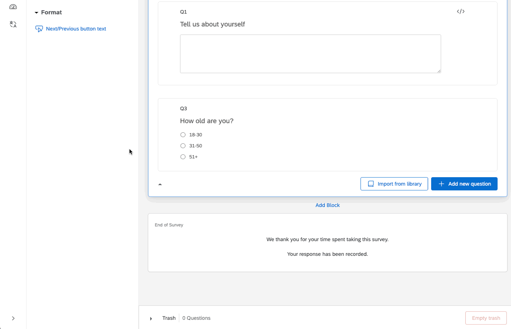

# Roundtable Alias Qualtrics integration

This repository contains details on using the [Roundtable](https://roundtable.ai) Alias API for survey bot and fraud detection with Qualtrics.

If you have questions or issues with integration, feel free to contact us at [support@roundtable.ai](mailto:support@roundtable.ai) and our team will be happy to help.

## Integration steps

The Qualtrics integration works by tracking participant behavior on open-ended questions and then calling the API at the end of the survey. The response data is then stored on the [Roundtable Dashboard](https://roundtable.ai/dashboard).

### Template

You can import our [survey template](alias_example_survey.qsf) directly into Qualtrics to get started. You just need to add the `survey_id` and `qualtrics_key` to the submission script (see step 3 below). Instructions on importing surveys is given [here](https://www.qualtrics.com/support/survey-platform/survey-module/survey-tools/import-and-export-surveys/).

Follow these steps to integrate Alias with Qualtrics:

1. **Generate a Qualtrics key**: On your [Roundtable account](https://roundtable.ai/account), generate a Qualtrics key for the survey. Add the url for the survey and an expiration date (every survey will have a separate Qualtrics key). Make sure to store the key after generation.

2. **Add Javascript tracker to every open-end:** Our [open-ended tracker](qualtrics-oe-tracker.js) generates a history of every change made for each open-ended textbox. To use this tracker, simply paste the code into the "Javascript" block for any open-ended question (you must have at least one open-ended question to call the Alias API).

3. **Add the submission script:** Add the [submission script](qualtrics-end-of-survey-tracker.js) to the last question in the survey. If your last question is an open end, simply add it after the open-end tracker code. Set the `qualtrics_key` to the key you generated in step 1, and `survey_id` to a string id for the survey.

4. **Add an embedded data field:** Add an embedded data field called `alias_participant_id` to your survey.

5. **Run your survey:** All of the data needed for the Alias API will be stored in the `alias_data` embedded data field.
6. **View the results:** The results of the API calls will be stored on the [Roundtable Dashboard](https://roundtable.ai/dashboard) for every survey you run.

## Programmatic access

If you prefer to call the API after running the experiment so it directly integrates with your Qualtrics dataset and have experience running Python scripts, you can use our [programmatic access](programmatic_access/) integration.