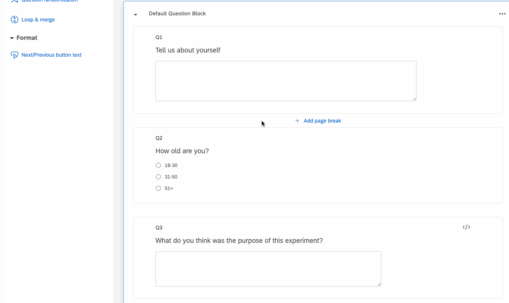

# Roundtable Alias Qualtrics integration

This directory contains details on programatically using the [Roundtable](https://roundtable.ai) Alias API for survey bot and fraud detection with Qualtrics.

## Integration steps

The Qualtrics integration works by adding a new column to your datasets with response behavior for each participant. This data is then fed to the Alias API at the end of the survey (or whenever you choose to pass the survey data to the API).

Follow these steps to integrate Alias with Qualtrics. Alternatively, you can important the [example_survey](example_survey.qsf) template and adjust it as needed.

1. **Add Javascript Tracker:** Our [Qualtrics javascript tracker](qualtrics-tracker.js) generates a history of every change made for each open-ended textbox. To use this tracker, simply paste the code into the "Javascript" block for any open-ended question (you must have at least one open-ended question to call the Alias API).

2. **Add an embedded data field:** Add an embedded data field called `alias_data` to your survey.

3. **Run your survey:** All of the data needed for the Alias API will be stored in the `alias_data` embedded data field.
4. **Export your Qualtrics data**: After running your survey, export your dataset from Qualtrics as a CSV.

5. **Upload to the Dashboard**: Upload the exported CSV to the [Alias Dashboard](https://roundtable.ai/dashboard). This will call the Alias API for every tracked question and merge the results with your dataset.

