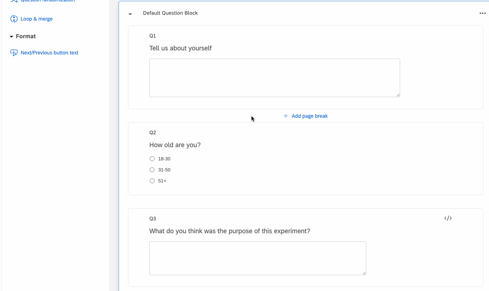
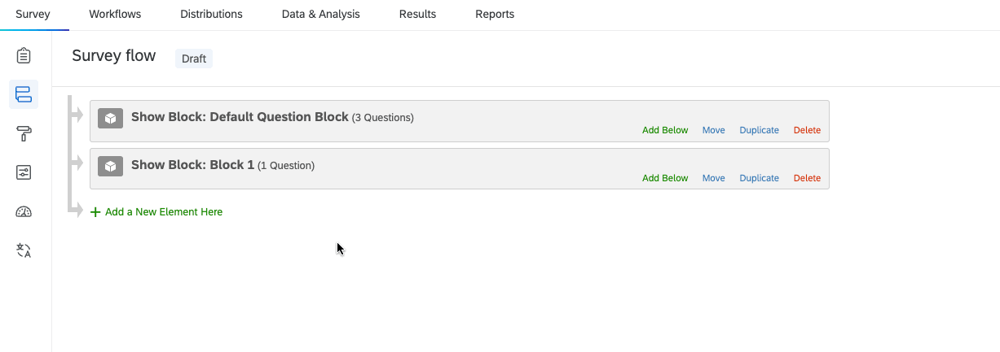

# Roundtable Alias Qualtrics integration

This directory contains details on programatically using the [Roundtable](https://roundtable.ai) Alias API for survey bot and fraud detection with Qualtrics.

## Integration steps

The Qualtrics integration works by adding a new column to your datasets with response behavior for each participant. This data is then fed to the Alias API at the end of the survey (or whenever you choose to pass the survey data to the API).

Follow these steps to integrate Alias with Qualtrics:

1. **Add Javascript Tracker:** Our [Qualtrics javascript tracker](qualtrics-tracker.js) generates a history of every change made for each open-ended textbox. To use this tracker, simply paste the code into the "Javascript" block for any open-ended question (you must have at least one open-ended question to call the Alias API).

2. **Add an embedded data field:** Add an embedded data field called `alias_data` to your survey.

3. **Run your survey:** All of the data needed for the Alias API will be stored in the `alias_data` embedded data field.
4. **Generate an API key:** Sign up at [https://roundtable.ai/sign-up](https://roundtable.ai/sign-up), navigate to your [account](https://roundtable.ai/account), and generate an API key.
5. **Export your data and call the API:** Export your survey data as a CSV from Qualtrics, and call the API using the [call-api.py](call-api.py) script. Note that you will have to add an ID for the survey, each participant, as well as your API key to this script. This script will call the API and automatically add new columns with data for (1) the total number of flags generated and (2) flags for each open-ended question (empty responses will be ignored). For more details on calling the API, see [the Alias API documentation](https://github.com/roundtableAI/alias-api).